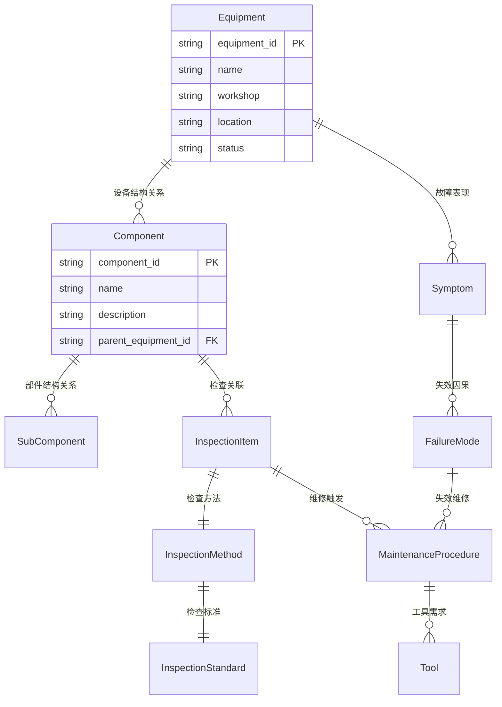

# 本体模型输出格式指南

本文档描述将本体 Schema 转换为各种可执行格式的规范。

## 目录

1. [Neo4j Cypher](#neo4j-cypher)
2. [OWL/RDF (Turtle)](#owlrdf-turtle)
3. [JSON-LD](#json-ld)
4. [Mermaid ER 图](#mermaid-er-图)

---

## Neo4j Cypher

### 约束和索引

为每个实体创建唯一性约束和索引：

```cypher
// 节点唯一性约束
CREATE CONSTRAINT IF NOT EXISTS FOR (e:Equipment) REQUIRE e.equipment_id IS UNIQUE;
CREATE CONSTRAINT IF NOT EXISTS FOR (c:Component) REQUIRE c.component_id IS UNIQUE;

// 全文搜索索引（可选）
CREATE FULLTEXT INDEX entity_name_index IF NOT EXISTS
FOR (n:Equipment|Component|SubComponent) ON EACH [n.name];
```

### 节点创建模板

```cypher
// 创建节点 — 每个实体类型一个 CREATE 语句
CREATE (e:Equipment {
  equipment_id: $equipment_id,
  name: $name,
  workshop: $workshop,
  location: $location,
  status: 'active'
})
```

**规则：**
- 节点标签使用 PascalCase（与实体英文名一致）
- 属性名使用 snake_case
- 不可为空的属性在 CREATE 中必须提供
- 有默认值的属性包含在模板中
- 枚举属性添加注释说明可选值

### 关系创建模板

```cypher
// 创建关系
MATCH (e:Equipment {equipment_id: $equip_id})
MATCH (c:Component {component_id: $comp_id})
CREATE (e)-[:HAS_COMPONENT {
  relationship_type: 'contains',
  hierarchy_level: 1,
  installation_date: $install_date
}]->(c)
```

**规则：**
- 关系类型使用 UPPER_SNAKE_CASE
- 关系属性在花括号中定义
- 使用参数化查询（`$param` 格式）

### 查询模板

为每条业务链路生成示例查询：

```cypher
// 设备结构查询
MATCH path = (e:Equipment)-[:HAS_COMPONENT*1..3]->(part)
WHERE e.equipment_id = $id
RETURN path

// 故障诊断链路
MATCH (e:Equipment)-[:SHOWS_SYMPTOM]->(s:Symptom)
      -[:CAUSED_BY]->(fm:FailureMode)
      -[:INVOLVES]->(c:Component)
WHERE e.equipment_id = $id
RETURN e, s, fm, c
```

---

## OWL/RDF (Turtle)

### 命名空间定义

```turtle
@prefix rdf: <http://www.w3.org/1999/02/22-rdf-syntax-ns#> .
@prefix rdfs: <http://www.w3.org/2000/01/rdf-schema#> .
@prefix owl: <http://www.w3.org/2002/07/owl#> .
@prefix xsd: <http://www.w3.org/2001/XMLSchema#> .
@prefix : <http://example.org/ontology#> .
```

### 类定义（实体 → OWL Class）

```turtle
:Equipment a owl:Class ;
    rdfs:label "设备"@zh ;
    rdfs:label "Equipment"@en ;
    rdfs:comment "升降机设备主体"@zh .
```

### 数据属性（实体属性 → OWL DatatypeProperty）

```turtle
:equipment_id a owl:DatatypeProperty ;
    rdfs:domain :Equipment ;
    rdfs:range xsd:string ;
    rdfs:label "设备编号"@zh .

:status a owl:DatatypeProperty ;
    rdfs:domain :Equipment ;
    rdfs:range xsd:string ;
    rdfs:comment "设备状态，可选值：active, inactive"@zh .
```

**规则：**
- 不可为空的属性标记为 `owl:minCardinality 1`
- 枚举属性使用 `owl:oneOf` 限制值范围
- 布尔属性范围为 `xsd:boolean`
- 日期属性范围为 `xsd:date` 或 `xsd:dateTime`
- 数值属性范围为 `xsd:integer` 或 `xsd:decimal`

### 对象属性（关系 → OWL ObjectProperty）

```turtle
:hasComponent a owl:ObjectProperty ;
    rdfs:domain :Equipment ;
    rdfs:range :Component ;
    rdfs:label "设备结构关系"@zh ;
    rdfs:comment "设备与部件的组成关系"@zh .
```

### 属性约束

```turtle
:Equipment rdfs:subClassOf [
    a owl:Restriction ;
    owl:onProperty :equipment_id ;
    owl:minCardinality "1"^^xsd:nonNegativeInteger
] .
```

---

## JSON-LD

### 上下文定义

```json
{
  "@context": {
    "@vocab": "http://example.org/ontology#",
    "schema": "http://schema.org/",
    "xsd": "http://www.w3.org/2001/XMLSchema#",
    "equipment_id": {"@type": "xsd:string"},
    "name": {"@type": "xsd:string"},
    "status": {"@type": "xsd:string"},
    "hasComponent": {"@type": "@id"},
    "belongsTo": {"@type": "@id"}
  }
}
```

### 实体实例模板

```json
{
  "@context": "http://example.org/ontology/context.jsonld",
  "@type": "Equipment",
  "@id": "equipment/EQ-001",
  "equipment_id": "EQ-001",
  "name": "四立柱滑板升降机",
  "workshop": "前内饰线",
  "status": "active",
  "hasComponent": [
    {"@id": "component/COMP-001"},
    {"@id": "component/COMP-002"}
  ]
}
```

### Schema 定义模板

```json
{
  "@context": {
    "@vocab": "http://example.org/ontology#"
  },
  "@graph": [
    {
      "@id": "Equipment",
      "@type": "rdfs:Class",
      "rdfs:label": {"@value": "设备", "@language": "zh"},
      "rdfs:comment": {"@value": "升降机设备主体", "@language": "zh"}
    },
    {
      "@id": "hasComponent",
      "@type": "rdf:Property",
      "rdfs:domain": {"@id": "Equipment"},
      "rdfs:range": {"@id": "Component"}
    }
  ]
}
```

---

## Mermaid ER 图

### 基本格式



**关系符号：**
- `||--||` 一对一
- `||--o{` 一对多
- `o{--o{` 多对多

**规则：**
- 每个实体列出关键属性（ID、name、核心属性）
- 标注 PK（主键）和 FK（外键）
- 关系标签使用中文名称
- 保持图表简洁，复杂模型可分多个图展示

---

## 格式选择建议

| 使用场景 | 推荐格式 |
|---------|---------|
| 需求沟通和文档化 | Excel (.xlsx) + Mermaid ER 图 |
| 图数据库部署 | Neo4j Cypher |
| 语义网和知识推理 | OWL/RDF (Turtle) |
| API 和数据交换 | JSON-LD |
| 快速可视化 | Mermaid ER 图 |
| 多系统集成 | JSON-LD + Neo4j Cypher |
